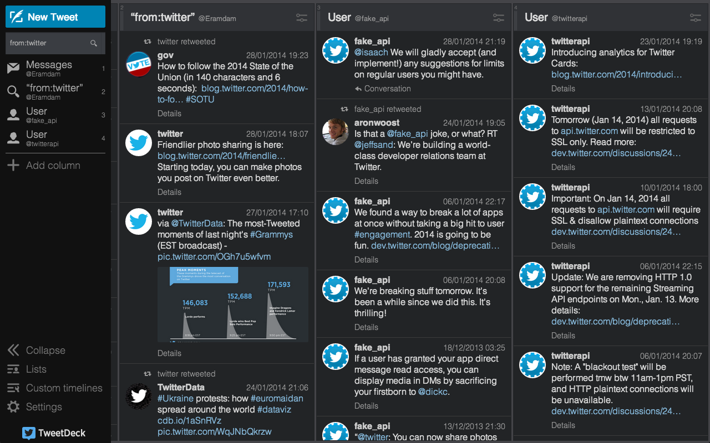
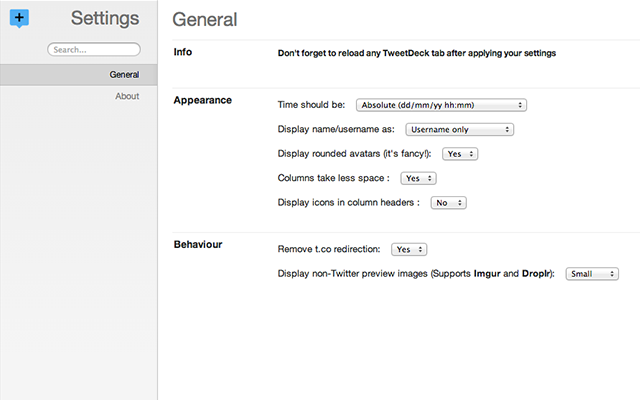

Better TweetDeck
===============

Adds some nice options on TweetDeck to provide a better experience on the webapp when used on Chrome.

Features
===============

As 0.0.7

+ Thumbnails for Imgur and Droplr images links
+ Allow to change the time formatting (Relative or Absolute)
+ Allow to change the username/fullname formatting (Username only, Fullname only, both or inverted (Username Fullname))
+ Display fancy circled avatars (they're hipsters, but they're cute too!)
+ Remove that god-damn useless t.co redirection on links

Screenshots
===============

Installation
===============

+ [Better TweetDeck on the Chrome Web Store](https://chrome.google.com/webstore/detail/better-tweetdeck/micblkellenpbfapmcpcfhcoeohhnpob)
+ Clone this repo and drag'n'drop the `source` folder in your Extensions window.

TODO
===============

+ Fix the UI icons that suck since the last update
+ Feel free to fill an issue/pull request for any cool features !
