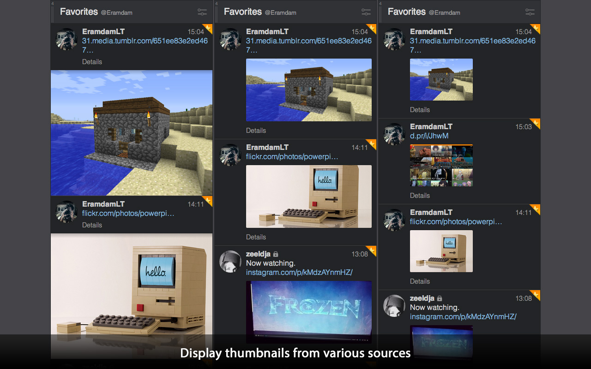
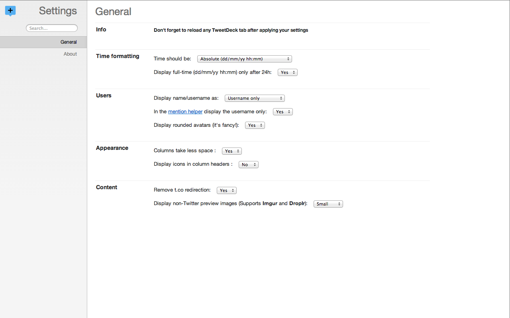
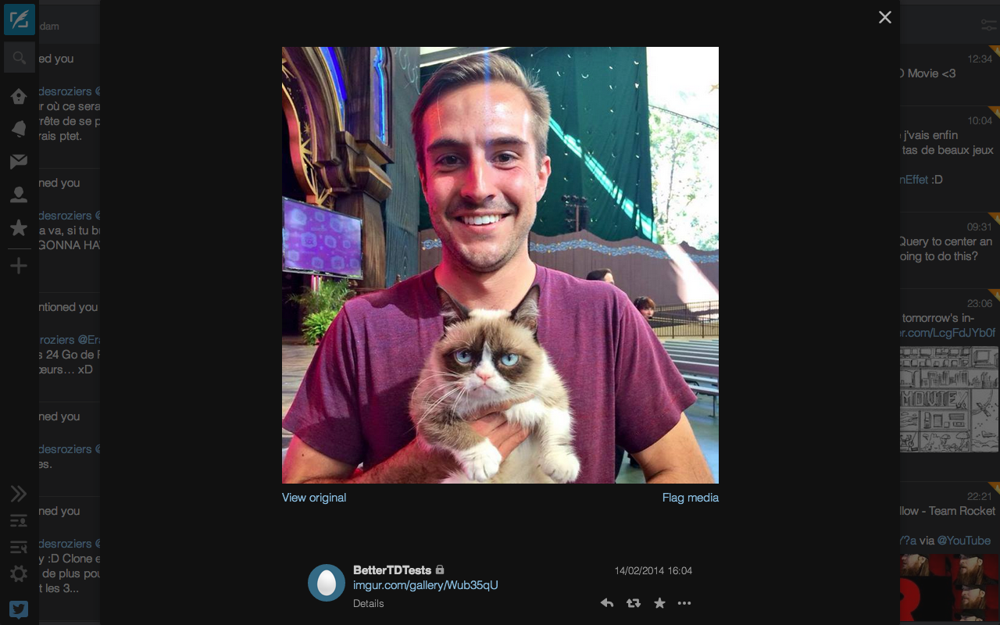

Better TweetDeck
===============

Adds some nice options on TweetDeck to provide a better experience on the webapp when used on Chrome.

Features
===============

As 1.2.4

+ "Lightboxes" for 500px, CloudApp, Dailymotion, Droplr, Flickr, Imgur, Instagram, Tumblr, Vimeo.
+ Thumbnails for 500px, CloudApp, Dailymotion, Droplr, Flickr, Imgur, Instagram, Tumblr, Vimeo.
+ Allow to hide or not the "play icon" on YouTube previews
+ Allow to display grayscale icons in Notifications columns
+ Allow to change the time formatting (Relative or Absolute)
+ Allow to change the username/fullname formatting (Username only, Fullname only, both or inverted (Username Fullname))
+ Display fancy circled avatars (they're hipsters, but they're cute too!)
+ Remove that god-damn useless t.co redirection on links
+ Display the full-time only if the tweet is posted with a 24h or more difference with current time

Screenshots
===============

Installation
===============

+ [Better TweetDeck on the Chrome Web Store](https://chrome.google.com/webstore/detail/better-tweetdeck/micblkellenpbfapmcpcfhcoeohhnpob)

**OR (if you're curious/adventurous/crazy)**

+ Clone this repo and drag'n'drop the `source` folder in your Extensions window. **But keep in mind you gonna get an unstable version of the extension**

Changelog
===============

1.2.x
+ Thumbnails are back in profil modal windows. I might add an option for that.
+ Lightboxes support for all the thumbnails services
+ Vimeo, Dailymotion and full Instagram support added
+ Imgur thumbnails are now 100% accurate
+ The extension display less useless errors in the console.

1.1.5
+ The extension fetches the user-size for thumbnails sooner, resulting in better working thumbnails

1.1.4
+ Fixed a "bug" where RT-boxes from TweetDeck are too wide

1.1.3
+ Now you can display only one thumbnail per tweet 

1.1.1
+ Fixed the font-weight of usernames when using the "inverted" naming display (in Notifications columns)

1.1.0
+ Thumbnail size now can be controlled within columns' settings!
+ Image services are in alphabetical order in settings. 
+ Large previews got a triangle like the Twitter's ones! #Illuminati
+ Fixed a bug with Imgur IDs that were wrongly parsed
+ Fixed **for real** the issue with "inverted" name displaying. Phew.

1.0.6
+ Fixed a weird bug with the "inverted" name display mode

1.0.5
+ Fixed a bug where imgur.com/gallery/ links where mistakenly considered as album

1.0.4
+ Fixed a bug where suffixes were mixed between providers, resulting in failed thumbnails

1.0.3
+ Fixed a bug where URL could get "lost" between AJAX calls, resulting in failed links

1.0.2
+ Large previews now fit perfectly with the Twitter ones
+ Added a "Welcome" screen
+ Re-ordered options
+ Improved options page, now displaying it at each update with a changelog
+ Added Tumblr support for previews
+ Added CloudApp support for previews
+ Added 500px support for previews
+ Added Flickr support for previews
+ Added Instagram support for previews
+ Added full Imgur support for previews
+ Added the possibility of choosing the services to display or not
+ Added possibility not to hide the play button on YouTube thumbnails

0.0.8

+ Added an option to display the full-time only after 24h
+ Removed a debug message which was still in the code (woops!)
+ Added an option to affect the [mention helper](http://f.cl.ly/items/0Q0I1t2k441639363V35/BehaYurCUAATDU8.png) only in name displaying
+ Re-ordered the options to have something nicer

TODO
===============

+ Fix the UI icons that suck since the last update
+ Feel free to fill an issue/pull request for any cool features !
