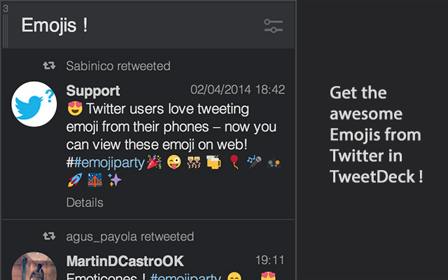

Better TweetDeck
===============

Adds some nice options on [TweetDeck](http://tweetdeck.twitter.com) to provide a better experience on the webapp when used on Chrome.

Features
===============

+ **Emojis !**
+ Lighboxes & thumbnails for :
    + 500px
    + CloudApp
    + Dailymotion
    + DeviantArt
    + Dribbble
    + Droplr
    + Flickr
    + Imgur
    + Img.ly
    + Instagram
    + Moby.to
    + Tumblr
    + Vimeo
    + yFrog
+ Allow to hide or not the "play icon" on YouTube previews
+ Allow to display grayscale icons in Notifications columns
+ Allow to change the time formatting (Relative or Absolute)
+ Allow to change the username/fullname formatting (Username only, Fullname only, both or inverted (Username Fullname))
+ Display fancy circled avatars (they're hipsters, but they're cute too!)
+ Remove that god-damn useless t.co redirection on links
+ Display the full-time only if the tweet is posted with a 24h or more difference with current time

Screenshots
===============

Installation
===============

+ [Better TweetDeck on the Chrome Web Store](https://chrome.google.com/webstore/detail/better-tweetdeck/micblkellenpbfapmcpcfhcoeohhnpob)

**OR (if you're curious/adventurous/crazy)**

+ Clone this repo and drag'n'drop the `source` folder in your Extensions window. **But keep in mind you gonna get an unstable version of the extension**

Contributing & Helping
===============

If you want to suggest something or address an issue, use the GitHub Issues and Pull Request feature.

However, if you feel generous and want to donate, you can do it by many ways:

+ [Donate on PayPal](https://www.paypal.com/cgi-bin/webscr?cmd=_s-xclick&hosted_button_id=RRY2KKZLNBJDG)
+ **BTC**: 16aWencNCFBtAqnKHj966uSqzQ66RYA87r